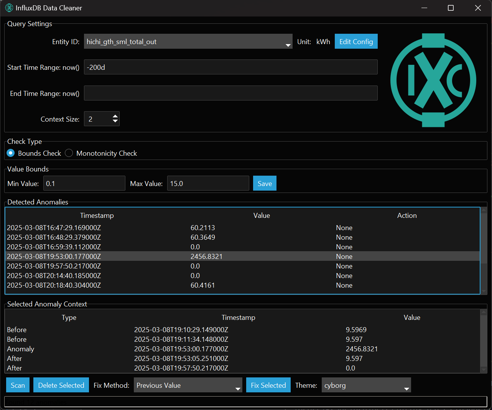

# Influx Data Cleaner

## Overview

The **Influx Data Cleaner** is a cross-platform desktop application built with Python and Tkinter, designed to help users manage and clean data stored in an InfluxDB database. It provides a UI to detect anomalies (e.g., out-of-bounds or non-monotonic values), and delete or fix selected data points, and customize the application theme.
The primary use case I made this for is for fixing entries in my own InfluxDB I run within Home Assistant.



## Features

- **Anomaly Detection**: Identify data points outside specified bounds or violating monotonicity
- **Data Management**: Delete or fix anomalies using methods like previous/next value or average interpolation
- **Configurable Entities**: Manage entity configurations (e.g., units, min/max values) via an intuitive interface
- **Theme Customization**: Switch between light and dark themes provided by ttkbootstrap
- **Cross-Platform**: Supports Windows, macOS, and Linux with a single codebase

## Disclaimer

This is acting on a live database, including deletion of datapoints.
This tool makes some assumptions currently on how the datapoints and database are structured.
Fixing the datapoints only works if they get written back with all the tags included that they had originally.
If your structure differs from mine this might not work. Deletion just requires the timestamp.
So before using this: Make sure you have a backup!
I am willing to make adjustments to make this more universal but this will require input and testing from your end! My DB currently uses Units as the measurement and I am using 'entity_id' tags to filter.
Some stuff is also hardcoded. If your db points does not fit roughly this scheme fixing won't work out of the box (this scheme is pretty common for users using the homeassistant influxdb plugin):

```json
{
    "measurement": anomaly["measurement"],
    "tags": {
        "domain": "sensor",
        "entity_id": anomaly["entity_id"],
        "source": "HA",
        "friendly_name": anomaly["friendly_name"],
    },
    "time": anomaly["time"],
    "fields": {"value": fix_value},
}
```

And again:
**-> I AM NOT RESPONSIBLE IF YOU DO NOT HAVE A BACKUP <-**

## Installation

### Prerequisites

- Python 3.10 or later
- Pip (Python package manager)

### Installing the Application

Packaged releases are available in the Releases section, or you can install and run manually:

```bash
git clone https://github.com/markusdd/influx-data-cleaner.git
cd influx-data-cleaner
# install deps directly or use a venv
pip install platformdirs ttkbootstrap influxdb darkdetect
# now you can just run it
python3 influx_data_cleaner.py

# in case you want to manually package it locally:
pip install pyinstaller
pyinstaller influx_data_cleaner.spec
```

## Acknowledgments

This has been built as a weekend project for my own needs, thanks to ttkbootstrap for making
Tkinter actually usuable cross-platform.
And thanks xAI and Grok3 which allowed for this to be finished and made publishable and
not just remain a 'hack script' on my private server. Maybe it's useful to someone else.
